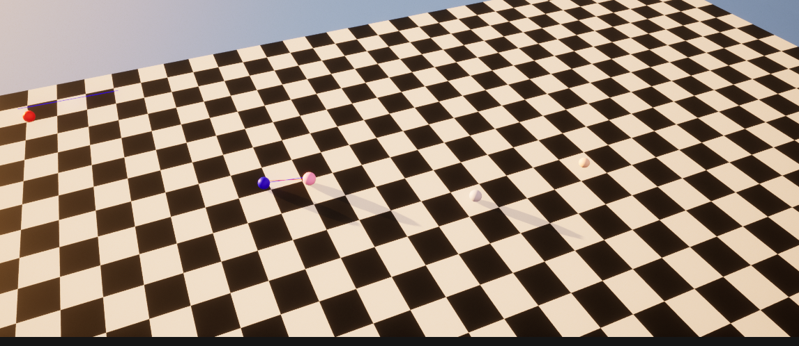

# Balls simulation

Simulation of balls moving in the grid. Here are requirements :

The auto battle mode is built around the idea of a deterministic C+
+ simulation in which the state is moved forward in discrete Time Steps
(100ms per Time Step in the visualisation). This is different than Unreal ‘ticks’.
This simulation can be run on the server side without the need for Unreal and
replicated exactly on the client side. The client side can supplement this
deterministic simulation with a real time visualisation which approximates the
deterministic simulation. We use a server generated seed to avoid players
predicting outcomes with certainty. This allows us to provide secure
guaranteed results server side and to provide what looks to be a real time
visualisation client side, without having to provide complex and expensive
real time synchronisation between the server and client.
The Challenge
Your challenge is to create a microcosm of the client which has a
deterministic simulation and a real time visualisation of that simulation. You
should use Unreal to deliver this challenge and all functionality should be
written in C++. You can use blueprints, but only for the purpose of making the
visual elements easier to create. The simulation code should all be written in
C++.

• The simulation takes place on a grid (approximately 100 x 100 squares,
but the exact number is up to you).

• Units walk between grid squares in the simulation at some fixed rate of
grid squares per Time Step.

• Two units (a red ball and a blue ball) must start on random grid
squares.

• They must move towards each other using some basic pathing. In the
simulation they must only ever be on a discrete grid square. In the
visualisation they can lerp between.

• Once within some defined range of your choosing (measured in grid
squares) they must begin to attack one another at some defined rate of
Time Steps per attack.

• The balls should receive some random number of ‘hit points’ between 2
and 5. This decides how many attacks they can take before dying.

• Attacks should be shown by increasing the brightness of the ball or any
other non UI based way of your choosing, as long as it is clear.

• The simulation must be deterministic.

<a href="SimulationTest.zip" class="md-button md-button--primary">Download</a>

